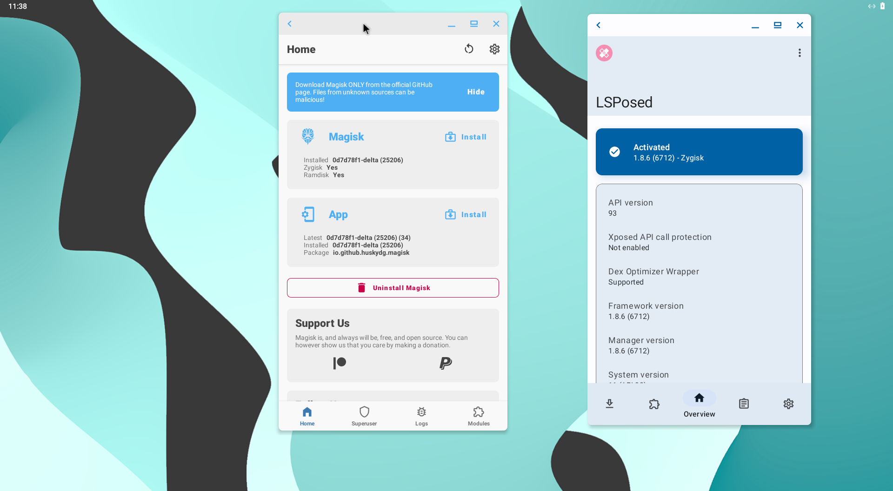
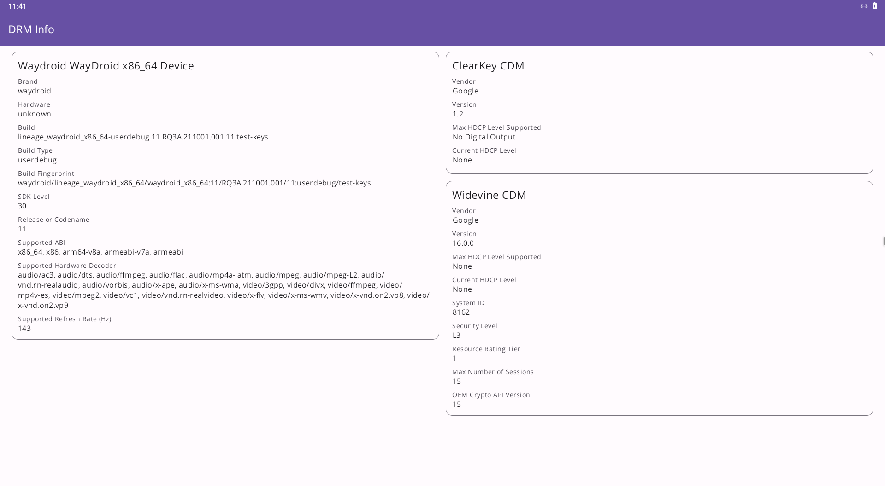
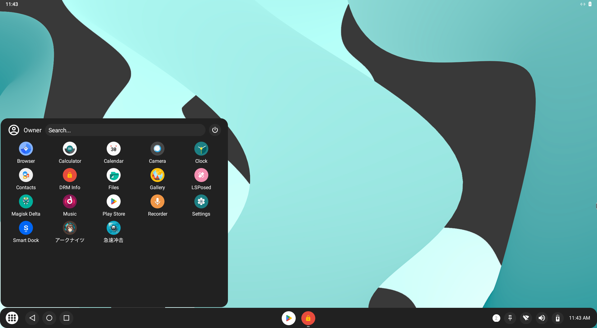
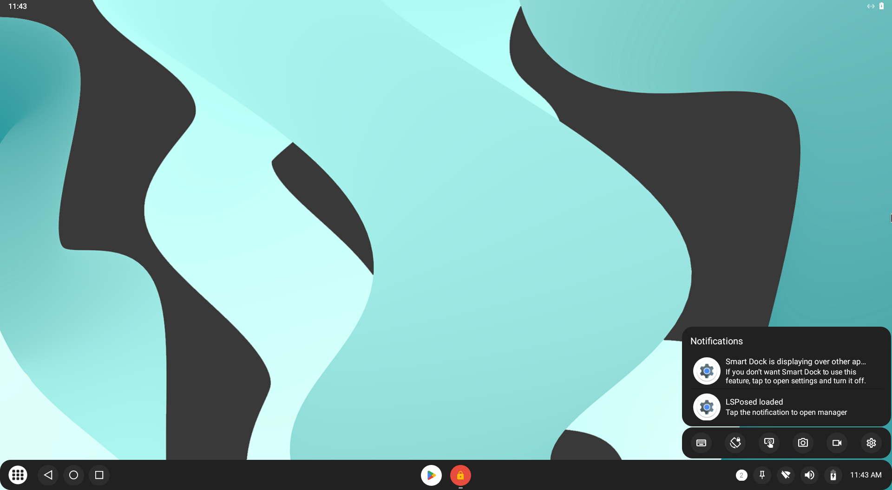
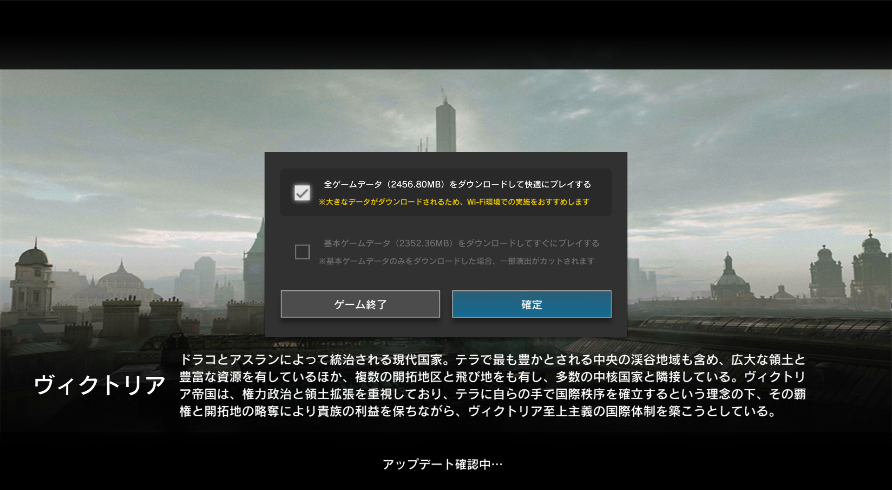
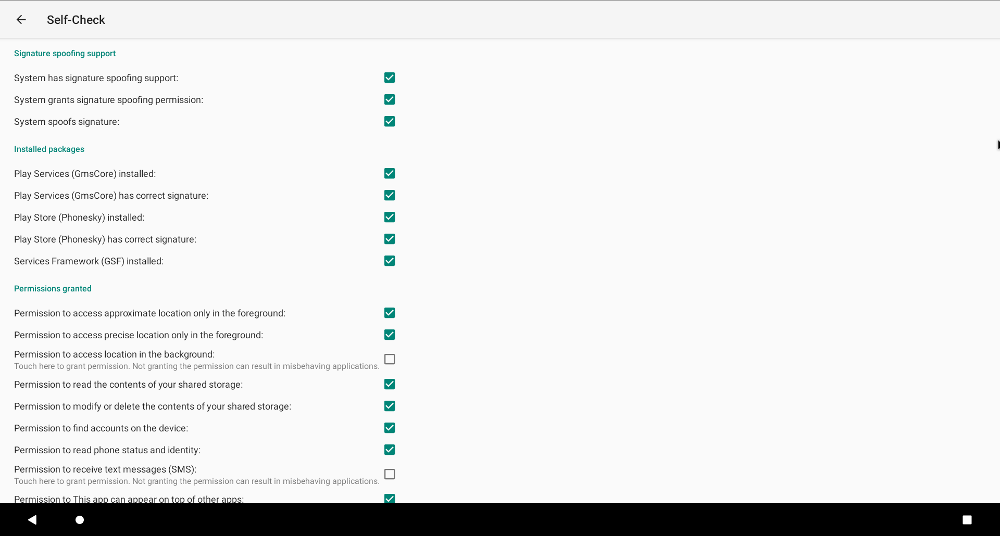

# Waydroid Extras Script
Script to add gapps and other stuff to waydroid !

# Installation/Usage
"lzip" and "sqlite" is required for this script to work, install it using your distribution's package manager:
## Arch, Manjaro and EndeavourOS based distributions:
	sudo pacman -S lzip sqlite
## Debian and Ubuntu based distributions:
	sudo apt install lzip sqlite  
## RHEL, Fedora and Rocky based distributions:
	sudo dnf install lzip sqlite
## openSUSE based distributions:
	sudo zypper install lzip sqlite
Then run:
	
    git clone https://github.com/casualsnek/waydroid_script
    cd waydroid_script
    sudo python3 -m pip install -r requirements.txt
    sudo python3 main.py install {gapps, magisk, libndk, libhoudini, nodataperm, smartdock, microg}

## Install OpenGapps


Open terminal and switch to directory where "main.py" is located then run:

    sudo python3 main.py install gapps

Then launch waydroid with:

    waydroid show-full-ui

After waydroid has finished booting open terminal and switch to directory where "main.py" is located then run:

    sudo python3 main.py google
Copy the returned numeric ID open ["https://google.com/android/uncertified/?pli=1"](https://google.com/android/uncertified/?pli=1) enter the id and register it, you may need to wait upto 10-20 minutes for device to get registered, then clear Google Play Service's cache and try logging in !

## Install Magisk



Open terminal and switch to directory where "main.py" is located then run:

    sudo python3 main.py install magisk

Magisk will be installed on next boot ! 

Zygisk and modules like LSPosed should work now.

Please use `Direct Install into system partition` to update Magisk in Magisk manager.

This script only focuses on Magisk installation, if you need more management, please check https://github.com/nitanmarcel/waydroid-magisk

## Install libndk arm translation 

libndk_translation from guybrush firmware. 

libndk seems to have better performance than libhoudini on AMD.

Open terminal and switch to directory where "main.py" is located then run:

    sudo python3 main.py install libndk

## Install libhoudini arm translation

Intel's libhoudini for intel/AMD x86 CPU, pulled from Microsoft's WSA 11 image

houdini version: 11.0.1b_y.38765.m

houdini64 version: 11.0.1b_z.38765.m

Open terminal and switch to directory where "main.py" is located then run:

    sudo python3 main.py install libhoudini

## Integrate Widevine DRM (L3)



Open terminal and switch to directory where "main.py" is located then run:

    sudo python3 main.py install widevine

## Install Smart Dock




Open terminal and switch to directory where "main.py" is located then run:

    sudo python3 main.py install smartdock

## Granting full permission for apps data (HACK)


This is a temporary hack to combat against the apps permission issue on Android 11. Whenever an app is open it will always enable a property (persist.sys.nodataperm) to make it execute a script to grant the data full permissions (777). The **correct** way is to use `sdcardfs` or `esdfs`, both need to recompile the kernel or WayDroid image.

Arknights, PUNISHING: GRAY RAVEN and other games won't freeze on the black screen.



Open terminal and switch to directory where "main.py" is located then run:

```
sudo python3 main.py install nodataperm
```
**WARNING**: Only tested on `lineage-18.1-20230121-VANILLA-waydroid_x86_64`. This script will replace `/system/framework/service.jar`, which may prevent WayDroid from booting.


Or you can run the following commands directly in `sudo waydroid shell`. In this way, every time a new game is installed, you need to run it again, but it's much less risky.

```
chmod 777 -R /sdcard/Android
chmod 777 -R /data/media/0/Android 
chmod 777 -R /sdcard/Android/data
chmod 777 -R /data/media/0/Android/obb 
chmod 777 -R /mnt/*/*/*/*/Android/data
chmod 777 -R /mnt/*/*/*/*/Android/obb
```

- https://github.com/supremegamers/device_generic_common/commit/2d47891376c96011b2ee3c1ccef61cb48e15aed6  
- https://github.com/supremegamers/android_frameworks_base/commit/24a08bf800b2e461356a9d67d04572bb10b0e819

## Install microG, Aurora Store and Aurora Droid



```
sudo python main.py install microg
```

## Get Android ID for device registration

You need to register you device with its it before being able to use gapps, this will print out your Android ID which you can use for device registration required for google apps:
Open terminal and switch to directory where "main.py" is located then run:

    sudo python3 main.py google

Star this repository if you find this useful, if you encounter problem create a issue on github !

## Error handling  

- WayDroid no longer boots

```
sudo waydroid upgrade -o
sudo systemctl restart waydroid-container.service
```
This will make `/var/lib/waydroid/waydroid_base.prop` return to original state, so libndk/libhoudini will be invalid. You need to modify `waydroid_base.prop` again.

Or use `sudo python3 main.py uninstall xxxxx` to remove what is causing the issue.

- Magisk installed: N/A

Check [waydroid-magisk](https://github.com/nitanmarcel/waydroid-magisk)

## Credits
- [WayDroid](https://github.com/waydroid/waydroid)
- [waydroid_script](https://github.com/casualsnek/waydroid_script)
- [Magisk Delta](https://huskydg.github.io/magisk-files/)
- [microG Project](https://microg.org)
- [Open GApps](https://opengapps.org)
- [Smart Dock](https://github.com/axel358/smartdock)
- [wd-scripts](https://github.com/electrikjesus/wd-scripts/)